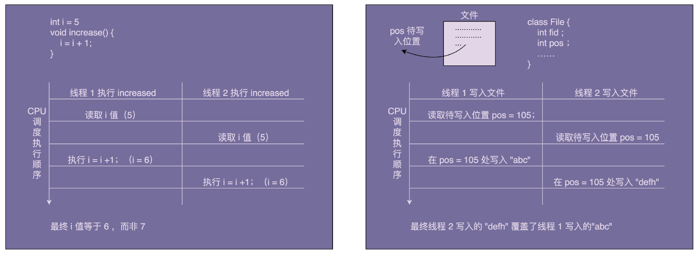

# 设计模式 - 创建型

## 分类

## 单例模式

**单例设计模式**（Singleton Design Pattern）理解起来非常简单。一个类只允许创建一个对
象（或者实例），那这个类就是一个单例类，这种设计模式就叫作单例设计模式，简称单例
模式。
### 案例：资源访问冲突
#### 原有实现
自定义实现了一个往文件中打印日志的 FileLogger 类，实现如下：

```java
public class FileLogger {

    private FileWriter fileWriter;

    public FileLogger() {
        File file = new File("log.txt");
        try {
            fileWriter = new FileWriter(file, true);
        } catch (IOException e) {
            e.printStackTrace();
        }
    }

    /**
     * 输出日志
     *
     * @param message
     */
    public void log(String message) {
        try {
            fileWriter.write(message);
        } catch (IOException e) {
            e.printStackTrace();
        }
    }
}
```

存在的问题：
在多线程环境下，如果两个线程同时给同一个共享变量加 1，因为共享变量是竞争资源，所以，共享变量最后的结果有可能并不是加了 2，而是只加了 1。同理，这里的 log.txt 文件也是竞争资源，两个线程同时往里面写数据，就有可能存在互相覆盖的情况。



通过加锁解决此问题。不过需要注意的是：由于在使用是通过`new FileLogger()`这种方式创建了新的对象。所有加锁时，要锁的是类而不是方法，即`synchronized(FileLogger.class)`，而非`synchronized(this)`。具体实现如下：

```java
public class FileLogger {

    private FileWriter fileWriter;

    public FileLogger() {
        File file = new File("log.txt");
        try {
            fileWriter = new FileWriter(file, true);
        } catch (IOException e) {
            e.printStackTrace();
        }
    }

    /**
     * 输出日志
     *
     * @param message
     */
    public void log(String message) {
        synchronized (FileLogger.class) {
            try {
                fileWriter.write(message);
            } catch (IOException e) {
                e.printStackTrace();
            }
        }
    }
}
```
> log() 函数加不加对象级别的锁，其实都没有关系。因为 FileWriter 本身就是线程安全的，它的内部实现中本身就加了对象级别的锁，因此，在在外层调用 write() 函数的时候，再加对象级别的锁实际上是多此一举。因为不同的 Logger 对象不共享 FileWriter 对象，所以，FileWriter 对象级别的锁也解决不了数据写入互相覆盖的问题。

#### 单例实现
将 Logger 设计成一个单例类，程序中只允许创建一个 Logger 对象，所有的线程共享使用的这一个 Logger 对象，共享一个 FileWriter 对象，而 FileWriter 本身是对象级别线程安全的，也就避免了多线程情况下写日志会互相覆盖的问题。
```java
public class FileLoggerSingleton {

    private FileWriter fileWriter;

    private static final FileLoggerSingleton INSTANCE = new FileLoggerSingleton();

    private FileLoggerSingleton() {
        File file = new File("log.txt");
        try {
            fileWriter = new FileWriter(file, true);
        } catch (IOException e) {
            e.printStackTrace();
        }
    }

    public static FileLoggerSingleton getInstance() {
        return INSTANCE;
    }

    public void log(String message) {
        try {
            fileWriter.write(message);
        } catch (IOException e) {
            e.printStackTrace();
        }
    }
}
```

### 1、单例的实现方式
关键点：
- 构造函数需要是 private 访问权限的，这样才能避免外部通过 new 创建实例；
- 考虑对象创建时的线程安全问题；
- 考虑是否支持延迟加载；
- 考虑 getInstance() 性能是否高（是否加锁）。

#### 饿汉式
在类加载的时候，instance 静态实例就已经创建并初始化好了，所以，instance 实例的创建过程是线程安全的。
不过，这样的实现方式不支持延迟加载（在真正用到 IdGenerator 的时候，再创建实例）
```java
public class IdGeneratorStarved {

    private AtomicLong id = new AtomicLong(0);
    private static final IdGeneratorStarved instance = new IdGeneratorStarved();

    private IdGeneratorStarved() {
    }

    public static IdGeneratorStarved getInstance() {
        return instance;
    }

    public long getId() {
        return id.incrementAndGet();
    }
}
```

#### 懒汉式
懒汉式相对于饿汉式的优势是支持延迟加载。具体的代码实现如下所示：
```java
public class IdGeneratorLazy {

    private AtomicLong id = new AtomicLong(0);
    private static IdGeneratorLazy instance = null;

    private IdGeneratorLazy() {
    }

    public synchronized static IdGeneratorLazy getInstance() {
        if (instance != null) {
            instance = new IdGeneratorLazy();
        }
        return instance;
    }

    public long getId() {
        return id.incrementAndGet();
    }
}
```
给 getInstance() 这个方法加了一把大锁（synchronzed），导致这个函数的并发度很低。量化一下的话，并发度是 1，也就相当于串行操作了。如果频繁地用到，那频繁加锁、释放锁及并发度低等问题，会导致性能瓶颈，这种实现方式就不可取了。

#### 懒加载的双重检测
饿汉式不支持延迟加载，懒汉式有性能问题，不支持高并发。那我们再来看一种既支持延迟加载、又支持高并发的单例实现方式，也就是双重检测实现方式。
这种实现方式中，只要 instance 被创建之后，即便再调用 getInstance() 函数也不会再进入到加锁逻辑中了。所以，这种实现方式解决了懒汉式并发度低的问题。具体的代码实现如下所示：

```java
public class IdGeneratorDoubleCheck {

    private AtomicLong id = new AtomicLong(0);
    private static IdGeneratorDoubleCheck instance = null;

    private IdGeneratorDoubleCheck() {
    }

    public static IdGeneratorDoubleCheck getInstance() {
        if (instance != null) {
            synchronized (IdGeneratorDoubleCheck.class) {
                if (instance != null) {
                    instance = new IdGeneratorDoubleCheck();
                }
            }
        }
        return instance;
    }

    public long getId() {
        return id.incrementAndGet();
    }
}
```
> **TIP**
> 存在的问题：因为指令重排序，可能会导致 IdGeneratorDoubleCheck 对象被 new 出来，并且赋值给 instance 之后，还没来得及初始化（执行构造函数中的代码逻辑），就被另一个线程使用了。
> 解决的方法：给 instance 成员变量加上 volatile 关键字，禁止指令重排序
> 实际上，只有很低版本的 Java 才会有这个问题。我们现在用的高版本的 Java 已经在JDK 内部实现中解决了这个问题（解决的方法很简单，只要把对象 new 操作和初始化操作设计为原子操作，就自然能禁止重排序）

#### 静态内部类
比双重检测更加简单的实现方法，那就是利用 Java 的静态内部类。类似饿汉式，但又能做到了延迟加载。实现如下：
```java
public class IdGeneratorInnerClass {

    private AtomicLong id = new AtomicLong(0);

    private IdGeneratorInnerClass() {
    }

    /**
     * 内部单例类
     */
    private static class SingletonHolder {
        private static final IdGeneratorInnerClass instance = new IdGeneratorInnerClass();
    }

    public static IdGeneratorInnerClass getInstance() {
        return SingletonHolder.instance;
    }

    public long getId() {
        return id.incrementAndGet();
    }
}
```
SingletonHolder 是一个静态内部类，当外部类 IdGeneratorInnerClass 被加载的时候，并不会创建 SingletonHolder 实例对象。只有当调用 getInstance() 方法时，SingletonHolder 才会被加载，这个时候才会创建 instance。insance 的唯一性、创建过程的线程安全性，都由JVM 来保证。所以，这种实现方法既保证了线程安全，又能做到延迟加载。

#### 枚举
基于枚举类型的单例实现。这种实现方式通过 Java 枚举类型本身的特性，保证了实例创建的线程安全性和实例的唯一性。具体的代码如下所示：
```java
public enum IdGeneratorEnum {
    /**
     * 单例
     */
    INSTANCE;
    private AtomicLong id = new AtomicLong(0);

    public long getId() {
        return id.incrementAndGet();
    }
}
```
> **枚举特点**
> 1.用enum定义枚举类默认继承了Java.lang.Enum类而不是继承了Object类。其中java.lang.Enum类实现了java.lang.Serializable和java.lang.Comparable两个接口
> 2.枚举类的构造函数只能使用private访问修饰符，如果省略了其构造器的访问控制符，则默认使用private修饰；
> 3.枚举类的所有实例必须在枚举类中显式列出，否则这个枚举类将永远都不能产生实例。列出这些实例时，系统会自动添加public static final修饰，无需显式添加。
#### 总结
- 饿汉式
饿汉式的实现方式，在类加载的期间，就已经将 instance 静态实例初始化好了，所以，
instance 实例的创建是线程安全的。不过，这样的实现方式不支持延迟加载实例。
- 懒汉式
懒汉式相对于饿汉式的优势是支持延迟加载。这种实现方式会导致频繁加锁、释放锁，以及
并发度低等问题，频繁的调用会产生性能瓶颈。
- 双重检测
双重检测实现方式既支持延迟加载、又支持高并发的单例实现方式。只要 instance 被创建
之后，再调用 getInstance() 函数都不会进入到加锁逻辑中。所以，这种实现方式解决了懒
汉式并发度低的问题。
- 静态内部类
利用 Java 的静态内部类来实现单例。这种实现方式，既支持延迟加载，也支持高并发，实
现起来也比双重检测简单。
- 枚举
最简单的实现方式，基于枚举类型的单例实现。这种实现方式通过 Java 枚举类型本身的特
性，保证了实例创建的线程安全性和实例的唯一性。

> JDK中 java.lang.Runtime是单例实现的，该类用于管理应用程序运行期间的各种信息，比如memory和processor信息，所以从该类的用途可以知道该类必须是单例的。

### 2、单例模式的替代方案
#### 单例的问题
- 单例对 OOP 特性的支持不友好
- 单例会隐藏类之间的依赖关系
- 单例对代码的扩展性不友好
- 单例对代码的可测试性不友好
- 单例不支持有参数的构造函数
#### 替代的方案
为了保证全局唯一，除了使用单例，我们还可以用静态方法来实现。不过，静态方法这种实现思路，并不能解决我们之前提到的问题（比如无法支持延迟加载）。如果要完全解决这些问题，我们可能要从根上，寻找其他方式来实现全局唯一类了。比如，通过工厂模式、IOC 容器（比如 Spring IOC 容器）来保证，由过程序员自己来保证（自己在编写代码的时候自己保证不要创建两个类对象）。
如果单例类并没有后续扩展的需求，并且不依赖外部系统，那设计成单例类就没有太大问题。对于一些全局的类，我们在其他地方 new 的话，还要在类之间传来传去，不如直接做成单例类，使用起来简洁方便。
### 3、分布式下的单例模式

## 工厂模式

## 建造者模式

## 原型模式