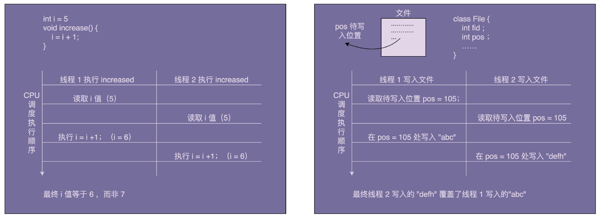

## 单例模式
Tags: #Java #设计模式

**单例设计模式**（Singleton Design Pattern）理解起来非常简单。一个类只允许创建一个对象（或者实例），那这个类就是一个单例类，这种设计模式就叫作单例设计模式，简称单例模式。
### 案例：资源访问冲突
#### 原有实现
自定义实现了一个往文件中打印日志的 FileLogger 类，实现如下：

```java
public class FileLogger {

    private FileWriter fileWriter;

    public FileLogger() {
        File file = new File("log.txt");
        try {
            fileWriter = new FileWriter(file, true);
        } catch (IOException e) {
            e.printStackTrace();
        }
    }

    /**
     * 输出日志
     *
     * @param message
     */
    public void log(String message) {
        try {
            fileWriter.write(message);
        } catch (IOException e) {
            e.printStackTrace();
        }
    }
}
```

存在的问题：
在多线程环境下，如果两个线程同时给同一个共享变量加 1，因为共享变量是竞争资源，所以，共享变量最后的结果有可能并不是加了 2，而是只加了 1。同理，这里的 log.txt 文件也是竞争资源，两个线程同时往里面写数据，就有可能存在互相覆盖的情况。



通过加锁解决此问题。不过需要注意的是：由于在使用是通过`new FileLogger()`这种方式创建了新的对象。所有加锁时，要锁的是类而不是方法，即`synchronized(FileLogger.class)`，而非`synchronized(this)`。具体实现如下：

```java
public class FileLogger {

    private FileWriter fileWriter;

    public FileLogger() {
        File file = new File("log.txt");
        try {
            fileWriter = new FileWriter(file, true);
        } catch (IOException e) {
            e.printStackTrace();
        }
    }

    /**
     * 输出日志
     *
     * @param message
     */
    public void log(String message) {
        synchronized (FileLogger.class) {
            try {
                fileWriter.write(message);
            } catch (IOException e) {
                e.printStackTrace();
            }
        }
    }
}
```
> log() 函数加不加对象级别的锁，其实都没有关系。因为 FileWriter 本身就是线程安全的，它的内部实现中本身就加了对象级别的锁，因此，在在外层调用 write() 函数的时候，再加对象级别的锁实际上是多此一举。因为不同的 Logger 对象不共享 FileWriter 对象，所以，FileWriter 对象级别的锁也解决不了数据写入互相覆盖的问题。

#### 单例实现
将 Logger 设计成一个单例类，程序中只允许创建一个 Logger 对象，所有的线程共享使用的这一个 Logger 对象，共享一个 FileWriter 对象，而 FileWriter 本身是对象级别线程安全的，也就避免了多线程情况下写日志会互相覆盖的问题。
```java
public class FileLoggerSingleton {

    private FileWriter fileWriter;

    private static final FileLoggerSingleton INSTANCE = new FileLoggerSingleton();

    private FileLoggerSingleton() {
        File file = new File("log.txt");
        try {
            fileWriter = new FileWriter(file, true);
        } catch (IOException e) {
            e.printStackTrace();
        }
    }

    public static FileLoggerSingleton getInstance() {
        return INSTANCE;
    }

    public void log(String message) {
        try {
            fileWriter.write(message);
        } catch (IOException e) {
            e.printStackTrace();
        }
    }
}
```

### 1、单例的实现方式
关键点：
- 构造函数需要是 private 访问权限的，这样才能避免外部通过 new 创建实例；
- 考虑对象创建时的线程安全问题；
- 考虑是否支持延迟加载；
- 考虑 getInstance() 性能是否高（是否加锁）。

#### 饿汉式
在类加载的时候，instance 静态实例就已经创建并初始化好了，所以，instance 实例的创建过程是线程安全的。
不过，这样的实现方式不支持延迟加载（在真正用到 IdGenerator 的时候，再创建实例）
```java
public class IdGeneratorStarved {

    private AtomicLong id = new AtomicLong(0);
    private static final IdGeneratorStarved instance = new IdGeneratorStarved();

    private IdGeneratorStarved() {
    }

    public static IdGeneratorStarved getInstance() {
        return instance;
    }

    public long getId() {
        return id.incrementAndGet();
    }
}
```

#### 懒汉式
懒汉式相对于饿汉式的优势是支持延迟加载。具体的代码实现如下所示：
```java
public class IdGeneratorLazy {

    private AtomicLong id = new AtomicLong(0);
    private static IdGeneratorLazy instance = null;

    private IdGeneratorLazy() {
    }

    public synchronized static IdGeneratorLazy getInstance() {
        if (instance != null) {
            instance = new IdGeneratorLazy();
        }
        return instance;
    }

    public long getId() {
        return id.incrementAndGet();
    }
}
```
给 getInstance() 这个方法加了一把大锁（synchronzed），导致这个函数的并发度很低。量化一下的话，并发度是 1，也就相当于串行操作了。如果频繁地用到，那频繁加锁、释放锁及并发度低等问题，会导致性能瓶颈，这种实现方式就不可取了。

#### 懒加载的双重检测
饿汉式不支持延迟加载，懒汉式有性能问题，不支持高并发。那我们再来看一种既支持延迟加载、又支持高并发的单例实现方式，也就是双重检测实现方式。
这种实现方式中，只要 instance 被创建之后，即便再调用 getInstance() 函数也不会再进入到加锁逻辑中了。所以，这种实现方式解决了懒汉式并发度低的问题。具体的代码实现如下所示：

```java
public class IdGeneratorDoubleCheck {

    private AtomicLong id = new AtomicLong(0);
    private static IdGeneratorDoubleCheck instance = null;

    private IdGeneratorDoubleCheck() {
    }

    public static IdGeneratorDoubleCheck getInstance() {
        if (instance != null) {
            synchronized (IdGeneratorDoubleCheck.class) {
                if (instance != null) {
                    instance = new IdGeneratorDoubleCheck();
                }
            }
        }
        return instance;
    }

    public long getId() {
        return id.incrementAndGet();
    }
}
```
> **TIP**
> 存在的问题：因为指令重排序，可能会导致 IdGeneratorDoubleCheck 对象被 new 出来，并且赋值给 instance 之后，还没来得及初始化（执行构造函数中的代码逻辑），就被另一个线程使用了。
> 解决的方法：给 instance 成员变量加上 volatile 关键字，禁止指令重排序
> 实际上，只有很低版本的 Java 才会有这个问题。我们现在用的高版本的 Java 已经在JDK 内部实现中解决了这个问题（解决的方法很简单，只要把对象 new 操作和初始化操作设计为原子操作，就自然能禁止重排序）

#### 静态内部类
比双重检测更加简单的实现方法，那就是利用 Java 的静态内部类。类似饿汉式，但又能做到了延迟加载。实现如下：
```java
public class IdGeneratorInnerClass {

    private AtomicLong id = new AtomicLong(0);

    private IdGeneratorInnerClass() {
    }

    /**
     * 内部单例类
     */
    private static class SingletonHolder {
        private static final IdGeneratorInnerClass instance = new IdGeneratorInnerClass();
    }

    public static IdGeneratorInnerClass getInstance() {
        return SingletonHolder.instance;
    }

    public long getId() {
        return id.incrementAndGet();
    }
}
```
SingletonHolder 是一个静态内部类，当外部类 IdGeneratorInnerClass 被加载的时候，并不会创建 SingletonHolder 实例对象。只有当调用 getInstance() 方法时，SingletonHolder 才会被加载，这个时候才会创建 instance。insance 的唯一性、创建过程的线程安全性，都由JVM 来保证。所以，这种实现方法既保证了线程安全，又能做到延迟加载。

#### 枚举
基于枚举类型的单例实现。这种实现方式通过 Java 枚举类型本身的特性，保证了实例创建的线程安全性和实例的唯一性。具体的代码如下所示：
```java
public enum IdGeneratorEnum {
    /**
     * 单例
     */
    INSTANCE;
    private AtomicLong id = new AtomicLong(0);

    public long getId() {
        return id.incrementAndGet();
    }
}
```
> **枚举特点**
> 1.用enum定义枚举类默认继承了Java.lang.Enum类而不是继承了Object类。其中java.lang.Enum类实现了java.lang.Serializable和java.lang.Comparable两个接口
> 2.枚举类的构造函数只能使用private访问修饰符，如果省略了其构造器的访问控制符，则默认使用private修饰；
> 3.枚举类的所有实例必须在枚举类中显式列出，否则这个枚举类将永远都不能产生实例。列出这些实例时，系统会自动添加public static final修饰，无需显式添加。
#### 总结
- 饿汉式
饿汉式的实现方式，在类加载的期间，就已经将 instance 静态实例初始化好了，所以，instance 实例的创建是线程安全的。不过，这样的实现方式不支持延迟加载实例。
- 懒汉式
懒汉式相对于饿汉式的优势是支持延迟加载。这种实现方式会导致频繁加锁、释放锁，以及并发度低等问题，频繁的调用会产生性能瓶颈。
- 双重检测
双重检测实现方式既支持延迟加载、又支持高并发的单例实现方式。只要 instance 被创建之后，再调用 getInstance() 函数都不会进入到加锁逻辑中。所以，这种实现方式解决了懒汉式并发度低的问题。
- 静态内部类
利用 Java 的静态内部类来实现单例。这种实现方式，既支持延迟加载，也支持高并发，实现起来也比双重检测简单。
- 枚举
最简单的实现方式，基于枚举类型的单例实现。这种实现方式通过 Java 枚举类型本身的特性，保证了实例创建的线程安全性和实例的唯一性。

> JDK中 java.lang.Runtime是单例实现的，该类用于管理应用程序运行期间的各种信息，比如memory和processor信息，所以从该类的用途可以知道该类必须是单例的。

### 2、单例模式的替代方案
#### 单例的问题
- 单例对 OOP 特性的支持不友好
OOP 的四大特性是封装、抽象、继承、多态。
```java
public class Order {
    public void create(...) {
        //...
        long id = IdGenerator.getInstance().getId();
        //...
    }
}
public class User {
    public void create(...) {
        // ...
        long id = IdGenerator.getInstance().getId();
        //...
    }
}
```
- 单例会隐藏类之间的依赖关系
通过构造函数、参数传递等方式声明的类之间的依赖关系，我们通过查看函数的定义，就能很容易识别出来。但是，单例类不需要显示创建、不需要依赖参数传递，在函数中直接调用就可以了。如果代码比较复杂，这种调用关系就会非常隐蔽。

- 单例对代码的扩展性不友好
单例类只能有一个对象实例。如果未来某一天，我们需要在代码中创建两个实例或多个实例，那就要对代码有比较大的改动。
比如数据库连接池，如果有慢、快两类SQL，一类一个连接池的话，单例就无法满足。所以，数据库连接池、线程池这类的资源池，最好还是不要设计成单例类。实际上，一些开源的数据库连接池、线程池也确实没有设计成单例类。

- 单例对代码的可测试性不友好
如果单例类依赖比较重的外部资源，比如 DB，我们在写单元测试的时候，希望能通过 mock 的方式将它替换掉。而单例类这种硬编码式的使用方式，导致无法实现 mock 替换。
除此之外，如果单例类持有成员变量（比如 IdGenerator 中的 id 成员变量），那它实际上相当于一种全局变量，被所有的代码共享。如果这个全局变量是一个可变全局变量，也就是说，它的成员变量是可以被修改的，那我们在编写单元测试的时候，还需要注意不同测试用例之间，修改了单例类中的同一个成员变量的值，从而导致测试结果互相影响的问题。

- 单例不支持有参数的构造函数
单例不支持有参数的构造函数，比如我们创建一个连接池的单例对象，我们没法通过参数来指定连接池的大小。
针对此问题的解决思路：
1、创建完实例之后，再调用 init() 函数传递参数。需要注意的是，我们在使用这个单例类的时候，要先调用 init() 方法，然后才能调用 getInstance() 方法，否则代码会抛出异常。具体的代码实现如下所示：

```java
// 单例类
public class SingletonParamOne {

    private static SingletonParamOne instance = null;

    private final int paramA;

    private final int paramB;

    private SingletonParamOne(int paramA, int paramB) {
        this.paramA = paramA;
        this.paramB = paramB;
    }

    public static SingletonParamOne getInstance() {
        if (instance == null) {
            throw new RuntimeException("Run SingletonParamOne#init() first!");
        }
        return instance;
    }

    public synchronized static SingletonParamOne init(int paramA, int paramB) {
        if (instance != null) {
            throw new RuntimeException("SingletonParamOne has been created!");
        }
        instance = new SingletonParamOne(paramA, paramB);
        return instance;
    }
}

// 使用方式
@Test
public void getInstance() throws InterruptedException {
    TestUtil.concurrentTest(100, startTime -> {
        try {
            SingletonParamOne.init(1, 2);
        } catch (Exception e) {
            e.printStackTrace();
        }
        SingletonParamOne instance = SingletonParamOne.getInstance();
        System.out.println(instance);
    });
}
```

2、将参数放到 getIntance() 方法中。具体的代码实现如下所示：
```java
public class SingletonParamTwo {

    private static SingletonParamTwo instance = null;

    private final int paramA;

    private final int paramB;

    private SingletonParamTwo(int paramA, int paramB) {
        this.paramA = paramA;
        this.paramB = paramB;
    }

    public synchronized static SingletonParamTwo getInstance(int paramA, int paramB) {
        if (instance == null) {
            instance = new SingletonParamTwo(paramA, paramB);
        }
        return instance;
    }
}
```

存在的问题：

如果两次调用`getInstance()`方法传递的参数不同，但返回的对象是第一次的参数，存在问题。

```java
SingletonParamTwo.getInstance(1,2);
SingletonParamTwo.getInstance(3,4);
```

解决的思路：

判断初始化的参数，增加提示。

```java
public synchronized static SingletonParamTwo getInstanceGraceful(int paramA, int paramB) {
        if (instance == null) {
            instance = new SingletonParamTwo(paramA, paramB);
        } else {
            if (paramA != instance.paramA || paramB != instance.paramB) {
                throw new RuntimeException("SingletonParamTwo has been initialized!");
            }
        }
        return instance;
    }
```
3、将参数放到另外一个全局变量中。具体的代码实现如下。Config 是一个存储了 paramA 和 paramB 值的全局变量。里面的值既可以像下面的代码那样通过 **静态常量** 来定义，也可以从**配置文件**中加载得到。实际上，这种方式是最值得推荐的。
```java
// 配置类
public class Config {

    public static final int PARAM_A = 1;
    public static final int PARAM_B = 2;
}

// 单例类
public class SingletonParamThree {

    private static SingletonParamThree instance = null;

    private final int paramA;

    private final int paramB;

    private SingletonParamThree() {
        this.paramA = Config.PARAM_A;
        this.paramB = Config.PARAM_B;
    }

    public synchronized static SingletonParamThree getInstance() {
        if (instance == null) {
            instance = new SingletonParamThree();
        }
        return instance;
    }
}
```

#### 替代的方案
为了保证全局唯一，除了使用单例，我们还可以用静态方法来实现。不过，静态方法这种实现思路，并不能解决我们之前提到的问题（比如无法支持延迟加载）。如果要完全解决这些问题，我们可能要从根上，寻找其他方式来实现全局唯一类了。比如，通过工厂模式、IOC 容器（比如 Spring IOC 容器）来保证，由过程序员自己来保证（自己在编写代码的时候自己保证不要创建两个类对象）。
```java
// 1、老的方式
public demoFunction() {
    long id = IdGenerator.getInstance().getId();
}
// 2、新的方式：依赖注入
public demoFunction(IdGenerator idGenerator) {
    long id = idGenerator.getId();
}
// 使用
IdGenerator idGenerator = IdGenerator.getInstance();
demoFunction(idGenerator);
```
如果单例类并没有后续扩展的需求，并且不依赖外部系统，那设计成单例类就没有太大问题。对于一些全局的类，我们在其他地方 new 的话，还要在类之间传来传去，不如直接做成单例类，使用起来简洁方便。
### 3、分布式下的单例模式
#### 单例模式的唯一性
单例的定义：一个类只允许创建唯一一个对象（或者实例），那这个类就是一个单例类，这种设计模式就叫作单例设计模式，简称单例模式。
在操作系统中，进程之间是不共享地址空间的，如果我们在一个进程中创建另外一个进程（比如，代码中有一个 fork() 语句，进程执行到这条语句的时候会创建一个新的进程），操作系统会给新进程分配新的地址空间，并且将老进程地址空间的所有内容，重新拷贝一份到新进程的地址空间中，这些内容包括代码、数据（比如 user 临时变量、User 对象）。所以，单例类在老进程中存在且只能存在一个对象，在新进程中也会存在且只能存在一个对象。而且，这两个对象并不是同一个对象，这也就说，单例类中对象的唯一性的作用范围是进程内的，在进程间是不唯一的。
**单例类中对象的唯一性的作用范围是进程内的，在进程间是不唯一的。**
#### 线程唯一的单例
**线程唯一**与**进程唯一**的区别
- 线程唯一：线程内唯一，线程间可以不唯一。
- 进程唯一：指的是进程内唯一，进程间不唯一。
假设 IdGenerator 是一个线程唯一的单例类。在线程 A 内，我们可以创建一个单例对象a。因为线程内唯一，在线程 A 内就不能再创建新的 IdGenerator 对象了，而线程间可以不唯一，所以，在另外一个线程 B 内，我们还可以重新创建一个新的单例对象 b。
如下所示。在代码中，我们通过一个 HashMap 来存储对象，其中 key 是线程 ID，value 是对象。这样我们就可以做到，不同的线程对应不同的对象，同一个线程只能对应一个对象。实际上，Java 语言本身提供了 ThreadLocal 工具类，可以更加轻松地实现线程唯一单例。不过，**ThreadLocal底层实现原理也是基于下面代码中所示的 HashMap**。
```java
public class IdGeneratorThread {

    private AtomicLong id = new AtomicLong(0);

    private static final ConcurrentHashMap<Long, IdGeneratorThread> instances
            = new ConcurrentHashMap<>();

    private IdGeneratorThread() {
    }

    public static IdGeneratorThread getInstance() {
        long currentThreadId = Thread.currentThread().getId();
        instances.putIfAbsent(currentThreadId, new IdGeneratorThread());
        return instances.get(currentThreadId);
    }

    public long getId() {
        return id.incrementAndGet();
    }
}
```
#### 集群环境的单例
集群环境应用部署是跨JVM的。因此，我们需要把这个单例对象序列化并存储到外部共享存储区（比如文件）。进程在使用这个单例对象的时候，需要先从外部共享存储区中将它读取到内存，并反序列化成对象，然后再使用，使用完成之后还需要再存储回外部共享存储区。
为了保证任何时刻，在进程间都只有一份对象存在，一个进程在获取到对象之后，需要对对象加锁，避免其他进程再将其获取。在进程使用完这个对象之后，还需要显式地将对象从内存中删除，并且释放对对象的加锁。
按照这个思路，我用伪代码实现了一下这个过程，具体如下所示：
```java
public class IdGeneratorCluster {

    private AtomicLong id = new AtomicLong(0);
    private static IdGeneratorCluster instance;
    private static SharedObjectStorage storage = new SharedObjectStorage();
    private static DistributedLock lock = new DistributedLock();

    private IdGeneratorCluster() {
    }

    public synchronized static IdGeneratorCluster getInstance() throws InstantiationException, IllegalAccessException {
        if (instance == null) {
            lock.lock();
            instance = (IdGeneratorCluster) storage.load(IdGeneratorCluster.class);

        }
        return instance;
    }

    public synchronized void freeInstance() {
        storage.save(this, IdGeneratorCluster.class);
        instance = null; //释放对象
        lock.unlock();
    }

    public long getId() {
        return id.incrementAndGet();
    }
}
```
#### “多例”模式
“单例”指的是，一个类只能创建一个对象。对应地，“多例”指的就是，一个类可以创建多个对象，但是个数是有限制的，比如只能创建 3 个对象。如果用代码来简单示例一下的话，就是下面这个样子：
```java
public class BackendServer {

    private Long serverNo;
    private String serverAddress;

    public static final int SERVER_COUNT = 3;
    public static final Map<Long, BackendServer> serverInstance = new HashMap<>();

    static {
        serverInstance.put(1L, new BackendServer(1L, "192.168.1.1:9200"));
        serverInstance.put(2L, new BackendServer(2L, "192.168.1.2:9200"));
        serverInstance.put(3L, new BackendServer(3L, "192.168.1.3:9200"));
    }

    private BackendServer(Long serverNo, String serverAddress) {
        this.serverNo = serverNo;
        this.serverAddress = serverAddress;
    }

    public BackendServer getInstance(long serverNo) {
        return serverInstance.get(serverNo);
    }

    public BackendServer getRandomInstance() {
        SecureRandom random = new SecureRandom();
        int no = random.nextInt(SERVER_COUNT) + 1;
        return serverInstance.get(no);
    }
}
```
实际上，对于多例模式，还有一种理解方式：同一类型的只能创建一个对象，不同类型的可
以创建多个对象。
如下，在代码中，logger name 就是刚刚说的“类型”，同一个 logger name 获取到的对象实例是相同的，不同的 loggername 获取到的对象实例是不同的。
```java
public class Logger {

    public static final ConcurrentHashMap<String, Logger> instances = new ConcurrentHashMap<>();

    private Logger() {
    }

    public static Logger getInstance(String loggerName) {
        instances.putIfAbsent(loggerName, new Logger());
        return instances.get(loggerName);
    }

    public void log(String message) {
        System.out.println(message);
    }

    public static void main(String[] args) {
        Logger logger = Logger.getInstance("User.class");
        Logger logger1 = Logger.getInstance("Role.class");
        Logger logger2 = Logger.getInstance("Group.class");
    }
}
```
这种多例模式的理解方式有点类似工厂模式。它跟工厂模式的不同之处是，多例模式创建的对象都是同一个类的对象，而工厂模式创建的是不同子类的对象。